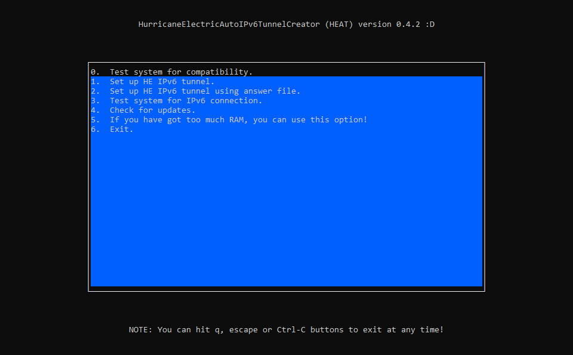
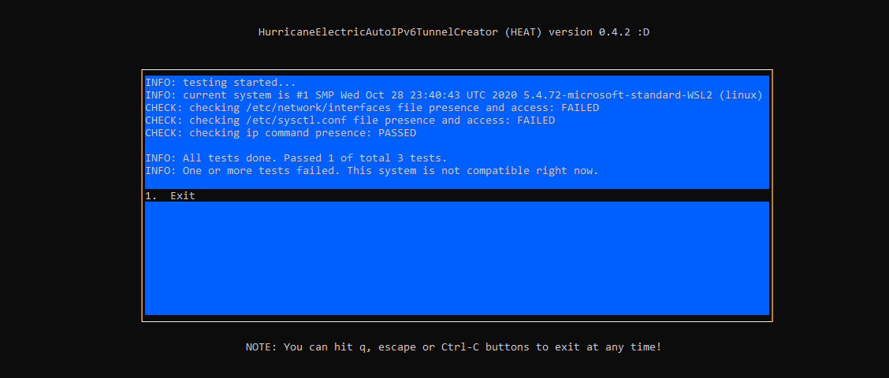

<!--
*** Using https://github.com/othneildrew/Best-README-Template as a template.
-->

[![Contributors][contributors-shield]][contributors-url]
[![Forks][forks-shield]][forks-url]
[![Stargazers][stars-shield]][stars-url]
[![Issues][issues-shield]][issues-url]
[![MIT License][license-shield]][license-url]


<!-- PROJECT LOGO -->
<br />
<p align="center">
  <a href="https://github.com/MrBoombastic/HurricaneElectricAutoIPv6TunnelCreator">
    
  </a>

<h3 align="center">HEAT</h3>

  <p align="center">
    The mini tool that helps you set up a new IPv6 tunnel from HurricaneElectric.
    <br />
    <a href="https://github.com/MrBoombastic/HurricaneElectricAutoIPv6TunnelCreator"></a>
    <br />
    ·
    <a href="https://github.com/MrBoombastic/HurricaneElectricAutoIPv6TunnelCreator/issues">Report Bug or Request Feature</a>
    ·
</p>


<!-- TABLE OF CONTENTS -->
<details open="open">
  <summary><h2 style="display: inline-block">Table of Contents</h2></summary>
  <ol>
    <li>
      <a href="#about-the-project">About The Project</a>
      <ul>
        <li><a href="#built-with">Built With</a></li>
      </ul>
    </li>
    <li>
      <a href="#getting-started">Getting Started</a>
      <ul>
        <li><a href="#prerequisites">Prerequisites</a></li>
        <li><a href="#installation">Installation</a></li>
      </ul>
    </li>
    <li><a href="#usage">Usage</a></li>
    <li><a href="#roadmap">Roadmap</a></li>
    <li><a href="#contributing">Contributing</a></li>
    <li><a href="#license">License</a></li>
    <li><a href="#contact">Contact</a></li>
    <li><a href="#disclaimer">Disclaimer</a></li>
  </ol>
</details>


<!-- ABOUT THE PROJECT -->

## About The Project



HEAT was created to help with setting up IPv6 tunnels from Hurricane Electric. Instructions found online are not always
clear or are very outdated. This tool can help you with that doing automatically as much as possible. Every option is
easy to access via pseudo-GUI. It feels like GRUB, but for IPv6. Haha.

### Built With

* [Node.JS](https://nodejs.org/en/)
* [Blessed](https://github.com/chjj/blessed)
* [pkg](https://github.com/vercel/pkg)

<!-- GETTING STARTED -->

## Compatibility

This tool is compatible only with systems using `/etc/network/interfaces` file. That means that perhaps only Debian is
compatible right now. As far as I know, Ubuntu is using `netplan`, so HEAT can't work there (despite that Ubuntu is
Debian based).

## Getting Started

To get a local copy up and running follow these simple steps.

First path - download prebuild

1. Go to [releases](https://github.com/MrBoombastic/HurricaneElectricAutoIPv6TunnelCreator/releases) and download the
   latest version. Typical binary filename is `HEAT-linux-amd64`.
   (Note: it's possibly better to copy link and download file via `wget`/`curl`, if target is a remote server.)
2. Run `chmod +x HEAT-linux-amd64` to give permissions to execute.
3. Run `sudo ./HEAT-linux-amd64` and choose options using keyboard. Pasting works best using the right click on a mouse
   button.

Second path - from source

0. Make sure, that you have got Node v16.4.1 installed.
1. Clone this repository using `git clone` or download and unpack ZIP file.
2. In repo's directory run `npm install` (or `yarn`), to install dependencies.
3. Run `npm run build`. Binary should be generated in a couple of seconds.
4. Copy file to target server and go to second step of the first path.

### Prerequisites

This list is applicable only, if you are running/building from source directly. Binaries can be run straight after
downloading.

* Node.js v16.4.1
  ```sh
  nvm install 16.4.1
  ```
* Yarn (optional, installs dependencies faster than `npm`)
   ```sh
   npm i yarn -g
   ```

<!-- USAGE EXAMPLES -->

## Usage

Use arrows to navigate in the menu. Right-click on the mouse should paste text from the clipboard.

HEAT has several modes:

- Compatibility check - This mode checks, if system is compatible with this tool.
- Tunnel setup - This mode asks about various things and then sets up IPv6 tunnel.
- Tunnel setup using answer file - Like above, but more automatically. You can copy `answer.json` file from this repo,
  fill it properly and put it next to binary. No questions will be asked.
- Connection test - Tests, if tunnel has been set up properly. If `answer.json` exists, IP to test from will be
  suggested.
- Updates check
- RAM eater - If you have got too much RAM, run this option now!!!




<!-- ROADMAP -->

## Roadmap

See the [open issues](https://github.com/MrBoombastic/HurricaneElectricAutoIPv6TunnelCreator/issues) for a list of
proposed features (and known issues).


<!-- CONTRIBUTING -->

## Contributing

Any contributions make are **greatly appreciated**.

1. Fork the Project
2. Create your Feature Branch (`git checkout -b feature/AmazingFeature`)
3. Commit your Changes (`git commit -m 'Add some AmazingFeature'`)
4. Push to the Branch (`git push origin feature/AmazingFeature`)
5. Open a Pull Request

<!-- LICENSE -->

## License

Distributed under the WTFPL License. See `LICENSE.md` for more information.

<!-- CONTACT -->

## Contact

Look at my GitHub profile!

<!-- ACKNOWLEDGEMENTS -->

## Disclaimer

* This tool modifies `crontab`. Back it up first!
* This tool modifies your network configuration. Make sure, that you have alternative ways to access your server, if
  working remotely.
* This tool is still in beta. Some features cannot work properly or at all.

[contributors-shield]: https://img.shields.io/github/contributors/MrBoombastic/HurricaneElectricAutoIPv6TunnelCreator.svg?style=for-the-badge

[contributors-url]: https://github.com/MrBoombastic/HurricaneElectricAutoIPv6TunnelCreator/graphs/contributors

[forks-shield]: https://img.shields.io/github/forks/MrBoombastic/HurricaneElectricAutoIPv6TunnelCreator.svg?style=for-the-badge

[forks-url]: https://github.com/MrBoombastic/HurricaneElectricAutoIPv6TunnelCreator/network/members

[stars-shield]: https://img.shields.io/github/stars/MrBoombastic/HurricaneElectricAutoIPv6TunnelCreator.svg?style=for-the-badge

[stars-url]: https://github.com/MrBoombastic/HurricaneElectricAutoIPv6TunnelCreator/stargazers

[issues-shield]: https://img.shields.io/github/issues/MrBoombastic/HurricaneElectricAutoIPv6TunnelCreator.svg?style=for-the-badge

[issues-url]: https://github.com/MrBoombastic/HurricaneElectricAutoIPv6TunnelCreator/issues

[license-shield]: https://img.shields.io/github/license/MrBoombastic/HurricaneElectricAutoIPv6TunnelCreator.svg?style=for-the-badge

[license-url]: https://github.com/MrBoombastic/repo/blob/master/LICENSE.md
